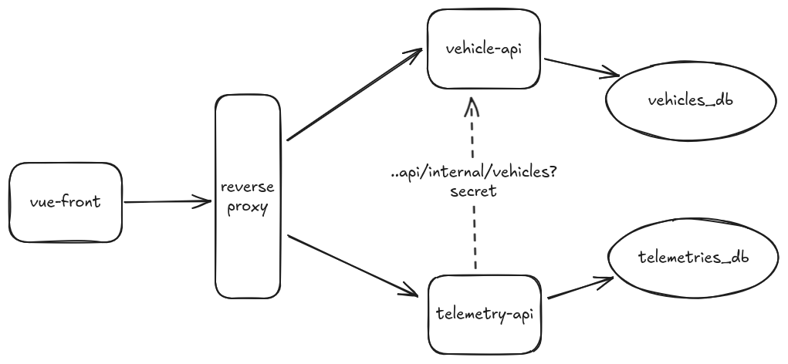

# Painel de Veículos MOBS2

## Introdução

Este projeto tem como objetivo construir uma aplicação para acompanhamento de veículos em tempo real.  
A solução é composta por três serviços principais:

- **Laravel**: responsável pelo cadastro de veículos e autenticação de usuários.  
- **NestJS**: fornece dados de telemetria simulada (posições, velocidade, combustível).  
- **Vue 3**: painel web para visualização dos veículos no mapa com histórico de posições.  

O sistema é executado em containers Docker para garantir padronização e facilidade de instalação.

## System Design

